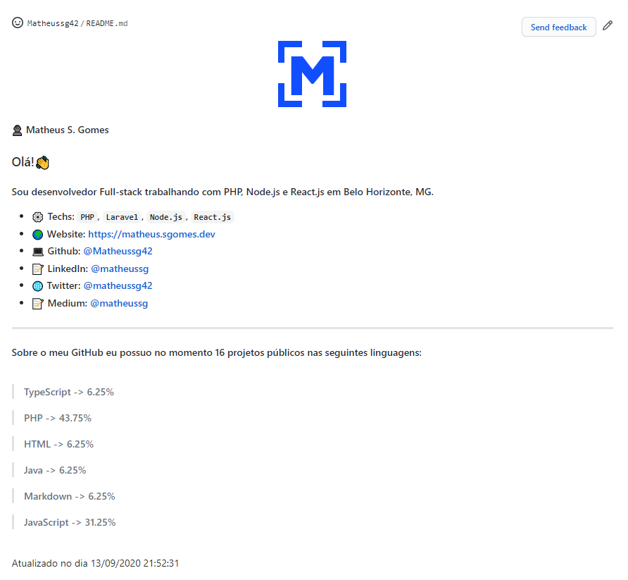
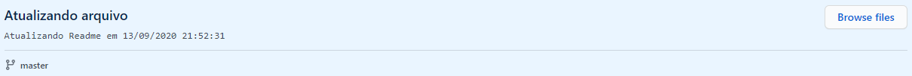

</>

👤 **Matheus S. Gomes** 

* Website: https://matheus.sgomes.dev
* Github: [@Matheussg42](https://github.com/Matheussg42)
* LinkedIn: [@matheussg](https://linkedin.com/in/matheussg)
* Medium: [@matheussg](https://medium.com/@matheussg)

---

  

Projeto criado para atualizar o Readme do meu GitHub com as tecnologias utilizadas nos meus projetos.

### Pré-Requisitos:

- PHP
- Composer
- Git
- Projeto Readme do GitHub clonado em sua máquina.

### Para utilizar:

- Baixe o projeto para a sua máquina.
- Altere o conteúdo da variável `$readmeTexto` do arquivo `index.php`.
- Rode o comando `composer install` para instalar as dependências.
- Execute o comando `php index.php`.

### Utilização:

- Terminal:

- GitHub:

